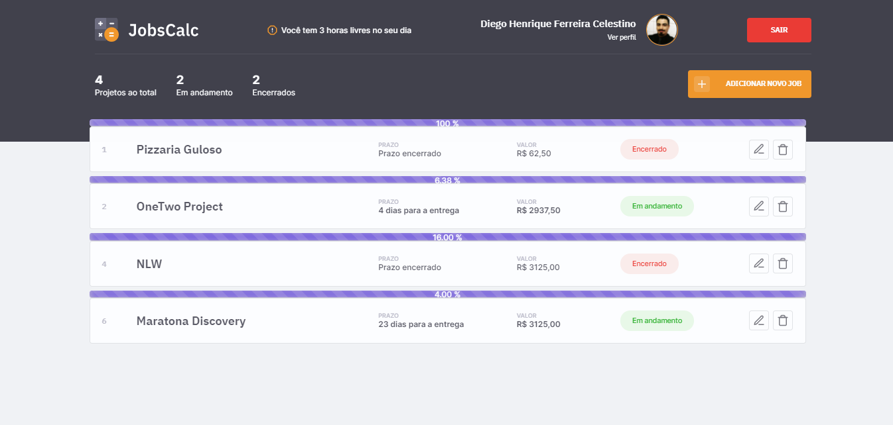
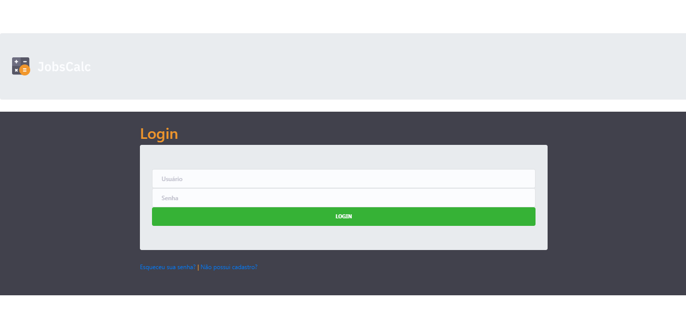
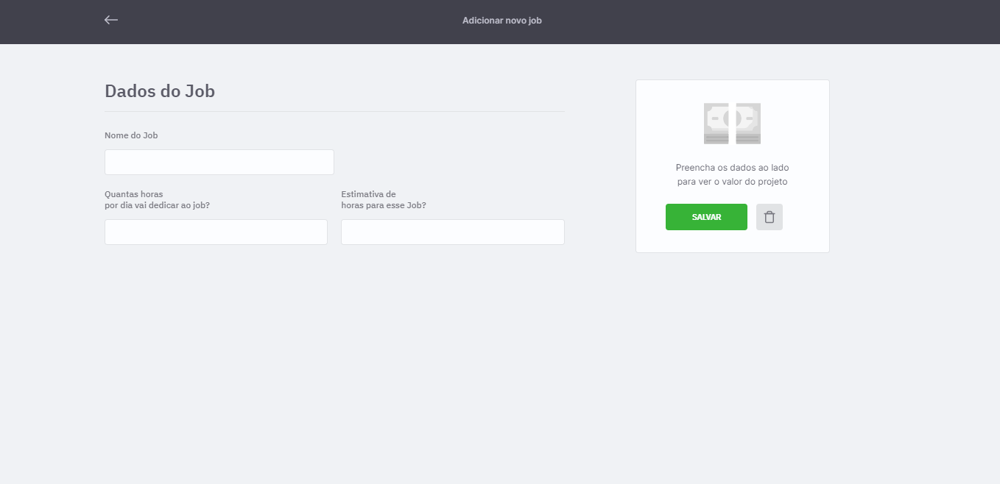
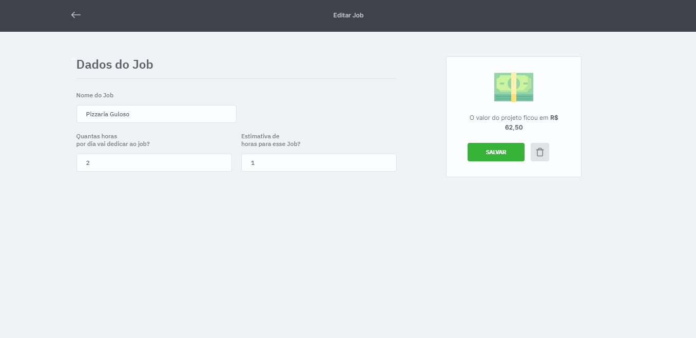
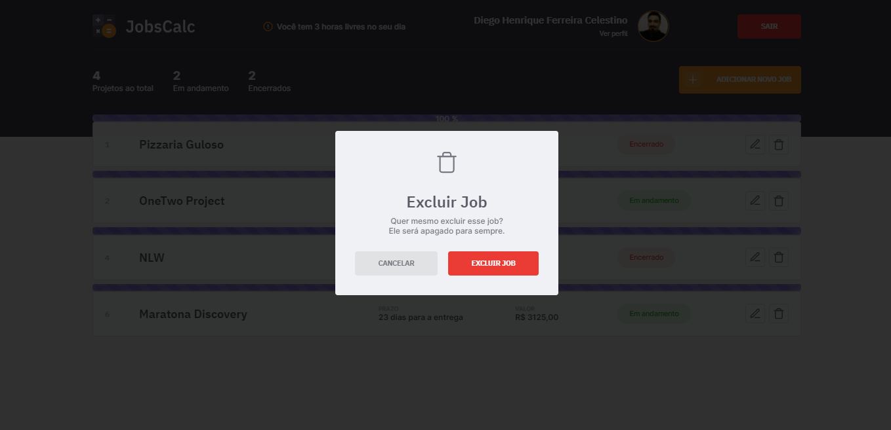

<h1 align="center">
  
</h1>

<h4 align="center">
  Projeto desenvolvido durante a 2° edição da Maratona Discovery da Rocketseat, totalmente gratuita e está disponivel no site<a href="https://app.rocketseat.com.br/dashboard">Rocketseat</a>
</h4>

  <a href="#-tecnologias">Tecnologias</a>&nbsp;&nbsp;&nbsp;|&nbsp;&nbsp;&nbsp;
  <a href="#-projeto">Projeto</a>&nbsp;&nbsp;&nbsp;|&nbsp;&nbsp;&nbsp;
  <a href="#-layout">Layout</a>&nbsp;&nbsp;&nbsp;|&nbsp;&nbsp;&nbsp;
  <a href="#memo-licença">Licença</a>
  <a href="#autor">Autor</a>

 

  

 

  

## 🚀 Tecnologias

Esse projeto foi desenvolvido com as seguintes tecnologias:

- HTML
- CSS
- JavaScript
- NodeJS
- EJS
- Express
- SQLite

## 💻 Projeto

O JobsCalc é uma aplicação de estimativa de cálculo para projetos freelancer, onde é possível cadastrar e excluir jobs (projetos), obtendo uma estimativa de custo de cada job. Além disso, é possível traçar o valor da hora da pessoa que estará usando o sistema 💰

## 🔖 Layout

Tela de login

  

Perfil

  

Cadastro de job

  

Edição de job

  

DashBoard

  

Excluir job

  

## :memo: Licença

Esse projeto está sob a licença MIT. Veja o arquivo [LICENSE](.github/LICENSE.md) para mais detalhes.

---
## Autor

Feito com ♥ by Diego Henrique Ferreira e orientado por Mayk Brito e Jakeliny Gracielly na Maratona Discovery da Rocketseat :wave: [Participe da comunidade!](https://discordapp.com/invite/gCRAFhc)

 