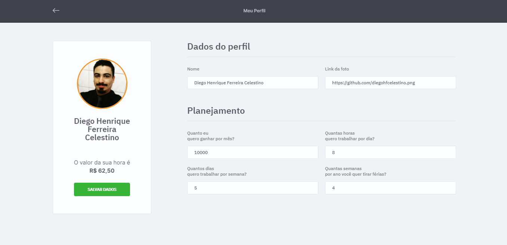

<h1 align="center">
  
</h1>

<h4 align="center">
  Projeto desenvolvido durante a 2° edição em 2021 da Maratona Discovery, totalmente gratuita e está disponivel no site <a href="https://app.rocketseat.com.br/dashboard">Rocketseat</a>
</h4>

<p align="center">
  <a href="#-tecnologias">Tecnologias</a>&nbsp;&nbsp;&nbsp;|&nbsp;&nbsp;&nbsp;
  <a href="#-projeto">Projeto</a>&nbsp;&nbsp;&nbsp;|&nbsp;&nbsp;&nbsp;
  <a href="#-layout">Layout</a>&nbsp;&nbsp;&nbsp;|&nbsp;&nbsp;&nbsp;
  <a href="#memo-licença">Licença</a>&nbsp;&nbsp;&nbsp;|&nbsp;&nbsp;&nbsp;
  <a href="#autor">Autor</a>&nbsp;&nbsp;&nbsp;|&nbsp;&nbsp;&nbsp;
  <a href="#contatos">Contatos</a>
</p>

<p align="center">
 

  
</p>

<br>

### DashBoard do projeto
<p align="center">
  
</p>

## 🚀 Tecnologias

Esse projeto foi desenvolvido com as seguintes tecnologias:

- HTML
- CSS
- JavaScript
- NodeJS
- EJS
- Express
- Passport
- SQLite

## 💻 Projeto

O JobsCalc é uma aplicação de estimativa de cálculo para projetos freelancer, onde é possível cadastrar e excluir jobs (projetos), obtendo uma estimativa de custo de cada job. Além disso, é possível traçar o valor da hora da pessoa que estará usando o sistema 💰

## 🔖 Layout


### Tela de login
<br>
Usuário ao entrar deve se autenticar informando usuário e senha para continuar navegando no sistema.
<br>
Usuário - admin<br>
Senha - 123 <br>
<p align="center">
  
</p>


### Perfil
<br>
Na tela do perfil é onde o usuário vai cadastar o nome e colocar sua foto.<br>
Tamber vai fazer o cadastro de seu planejamento do trabalho, onde deve informar salario mensal, horas trabalhadas por dia, dias por semana e quantas férias vai usufrir no ano.<br>
Com base nestas informações o sistema vai calcular qual o valor de sua hora de trabalho.
<br>
<p align="center">
  
</p>


### Cadastro de job
<br>
Para cadastrar um novo job basta clicar no botão "Adicionar Novo Job", serão informados o nome do job, quantas horas por dia vão ser dedicada neste job e qual a estimativa de horas para terminar o projeto.<br>
O sistema vai fazer o calculo do prazo para entrega do projeto (em dias), vai calcular o valor do projeto e também vai informar na barra de progresso quantos percentuais foram concluidos no projeto (conforme for lançando as horas dedicadas), ao atingir o total de horas planejadas o sistema vai concluir o projeto com 100% e encerrar o mesmo.
<br>
<p align="center">
  
</p>


### Edição de job
<br>
É possivel fazer a edição do job caso tenha cadastrado alguma informação errada e é nessa tela que tambem vai acrescentando as horas dedicadas.
<br>
<p align="center">
  
</p>


### Excluir job
<br>
Caso tenha cadastrado algum job e não quer controlar ele, ou não vai ser executado, basta excluir.
<br>
<p align="center">
  
</p>

### DashBoard
Na tela principal do sistema ficam todas as informações dos projetos (jobs), tem um dashboad bem interativo onde informa, quantas horas tem disponivel em seu dia, quantos projetos total, em andamento e encerrados.<br>
Para sair de sua conta, basta clicar no botão "Sair"
<br>
<p align="center">
  
</p>


## :tada: Como executar

```bash
# Faça o clone deste repositório para qualquer pasta de sua preferencia
$ git clone https://github.com/diegohfcelestino/maratona_discovery_2.git

# Vá até essa pasta
$ cd maratona_discovery_2

# rode esses comandos para instalar as dependências (lembrando que deverá ter o node instalado em sua máquina)
$ npm install

# use este comando para rodar o Projeto
$ npm run dev
```

## :memo: Licença

Esse projeto está sob a licença MIT. Veja o arquivo [LICENSE](.github/LICENSE.md) para mais detalhes.

---
## Autor

Feito com ♥ by Diego Henrique Ferreira e orientado por Mayk Brito e Jakeliny Gracielly na Maratona Discovery da Rocketseat :wave: [Participe da comunidade no discord!](https://discordapp.com/invite/gCRAFhc)
<br/>


## Contatos

Entre em contato em minhas redes.

[](https://github.com/diegohfcelestino)
[](https://www.linkedin.com/in/diego-ferreira-34b6348b/)
[](https://api.whatsapp.com/send?phone=+5516991187434&text=Hello!)
[](mailto:diegohfcelestino@gmail.com)
<br/>


## Sempre haverá um próximo nível
<br/>
O sistema está em evolução, os próximos passos são:<br/>
Colocar autenticação nas outras páginas(está apenas na tela de login).<br/>
Fazer calculo dos jobs quando finalizar, considerando que foi menos ou mais horas dedicadas, onde na tela será informado o valor planejado e o valor efetivo.<br/>
Colocar filtro no dashboard.<br/>
Entre outras melhorias que vão surgindo.<br/>
